# Video Upload System - Complete Implementation Guide

## 📋 Overview

This document explains how the video upload system works in the SkateHive app. The system is designed to handle video uploads across different devices (iPhone, Android, Desktop) with smart optimizations and fallbacks.

## 🎯 Main Goals

1. **Smart Processing**: Only process videos when necessary
2. **Device Optimization**: Different handling for iPhone, Android, and Desktop
3. **User Experience**: Progress feedback and error handling
4. **Quality Control**: Maintain video quality while reducing file sizes
5. **Duration Limits**: 15-second limit for regular users, bypass for users with >100 HP

## 📁 File Structure

```
components/homepage/
├── SnapComposer.tsx          # Main composer with video upload
├── VideoUploader.tsx         # Core video processing component
├── VideoTrimModal.tsx        # Video trimming interface
├── VideoTrimModalFooter.tsx  # Modal footer controls
├── VideoPlayer.tsx           # Video playback component
├── VideoTimeline.tsx         # Timeline scrubber
└── ThumbnailCapture.tsx      # Thumbnail generation

lib/utils/
└── videoProcessing.ts        # All video processing utilities
```

## 🔄 Complete Flow Diagram

```mermaid
graph TD
    A[User selects video] --> B{Check duration}
    B -->|>15s OR user has >100HP| C[Open VideoTrimModal]
    B -->|≤15s AND user <100HP| D[Direct upload]

    C --> E{User choice in modal}
    E -->|Trim| F[Create trimmed video]
    E -->|Use original| G[Use original file]

    F --> H[VideoUploader processing]
    G --> H
    D --> H

    H --> I{Detect device type}
    I -->|Desktop| J[FFmpeg processing]
    I -->|iPhone| K[iOS optimized processing]
    I -->|Android MP4| L[Skip processing - upload original]
    I -->|Android MOV| M[Convert MOV to MP4]

    J --> N[Upload to Hive]
    K --> N
    L --> N
    M --> N
```



## 📱 Device-Specific Behavior

### 🖥️ Desktop

- **Detection**: Not mobile user agent
- **Processing**: Full FFmpeg support
- **Output**: High-quality MP4
- **Speed**: Fast processing

### 📱 iPhone/iOS

- **Detection**: `/iPad|iPhone|iPod/` in user agent
- **Processing**: iOS-optimized FFmpeg with VFR handling
- **Output**: MP4 with iOS-specific encoding
- **Special handling**: Variable frame rate (VFR) to constant frame rate (CFR) conversion

### 🤖 Android

- **Detection**: `/Android/` in user agent
- **Smart rule**:
  - ✅ **MP4 files**: Skip processing (already optimized)
  - ❌ **MOV files**: Process (need conversion)
  - 🔧 **Other formats**: Process as needed

## 🧩 Core Components Explained

### 1. SnapComposer.tsx

**Purpose**: Main interface where users create posts with videos

**Key Functions**:

```typescript
// Check video duration and decide if trim modal is needed
const handleVideoFile = async (file: File) => {
  const duration = await getVideoDuration(file);

  // Open trim modal if video is >15s OR user has >100 HP
  if (duration > 15 || canBypassLimit) {
    setIsTrimModalOpen(true);
  } else {
    // Upload directly
    await videoUploaderRef.current.handleFile(file);
  }
};
```

**User HP Check**:

```typescript
const { hivePower } = useHivePower(user || "");
const canBypassLimit = hivePower !== null && hivePower >= 100;
```

### 2. VideoTrimModal.tsx

**Purpose**: Interface for trimming videos and capturing thumbnails

**Key Features**:

- Video player with timeline scrubber
- Trim selection (start/end times)
- Thumbnail capture
- Two tabs: Trim and Thumbnail

**Trimming Process**:

```typescript
const createTrimmedVideo = async (file, start, end) => {
  // Creates a new video using MediaRecorder
  // Records canvas in real-time between start and end times
  // Returns WebM blob
};
```

### 3. VideoUploader.tsx

**Purpose**: Handles all video processing and uploading

**Main Processing Logic**:

```typescript
// 1. Device detection
const device = detectiOSDevice();
const androidDevice = detectAndroidDevice();

// 2. Android optimization check
const androidSkipInfo = shouldSkipAndroidProcessing(file);
if (androidSkipInfo.shouldSkip) {
  // Skip processing for Android MP4 files
  processedFile = file;
} else {
  // Continue with normal processing
}

// 3. Processing based on device and file type
if (device.isIOS && isMovFile && iosOptimized) {
  // Use iOS-optimized processing
  mp4Blob = await convertToMp4iOS(file, ffmpegRef, setProgress);
} else {
  // Use standard processing
  mp4Blob = await convertToMp4(file, ffmpegRef, setProgress);
}
```

### 4. videoProcessing.ts

**Purpose**: All video processing utilities and device detection

**Key Functions**:

#### Device Detection

```typescript
// Detect iOS devices
export function detectiOSDevice(): {
  isIOS: boolean;
  isIPhone: boolean;
  isIPad: boolean;
  iosVersion?: number;
};

// Detect Android devices
export function detectAndroidDevice(): {
  isAndroid: boolean;
  isOldAndroid: boolean;
  androidVersion?: number;
  chromeVersion?: number;
};
```

#### Smart Processing Decisions

```typescript
// Check if we should skip processing for Android
export function shouldSkipAndroidProcessing(file: File): {
  shouldSkip: boolean;
  reason: string;
} {
  const androidDevice = detectAndroidDevice();

  // Skip processing for MP4 files from Android (already optimized)
  const isMp4File = file.name.toLowerCase().endsWith(".mp4");
  if (isMp4File && androidDevice.isAndroid) {
    return {
      shouldSkip: true,
      reason: "Android MP4 files are typically already optimized",
    };
  }

  return { shouldSkip: false, reason: "File may benefit from processing" };
}
```

#### Video Processing Functions

```typescript
// Standard MP4 conversion
export async function convertToMp4(file, ffmpegRef, onProgress);

// iOS-optimized conversion (handles VFR issues)
export async function convertToMp4iOS(file, ffmpegRef, onProgress);

// Video compression with quality control
export async function compressVideo(file, ffmpegRef, onProgress, shouldResize);

// Fallback compression for unsupported devices
export async function compressVideoFallback(file);

// iOS-specific fallback
export async function compressVideoiOSFallback(file);
```

## 🛠️ Processing Paths by Scenario

### Scenario 1: Desktop User with MP4 file

```
File → FFmpeg Detection ✅ → Standard Processing → MP4 Output
```

### Scenario 2: iPhone with MOV file

```
File → iOS Detection ✅ → iOS Optimized Processing → MP4 Output
- Handles VFR to CFR conversion
- iOS-specific FFmpeg settings
- Better slow-motion handling
```

### Scenario 3: Android with MP4 file

```
File → Android Detection ✅ → Skip Processing → Original Upload
- No processing needed (already optimized)
- Faster upload
- Original quality preserved
```

### Scenario 4: Android with MOV file

```
File → Android Detection ✅ → MOV Conversion → MP4/WebM Output
- Converts incompatible format
- Uses best available method (FFmpeg or fallback)
```

### Scenario 5: Old Android device

```
File → Old Android Detection ✅ → Fallback Processing → WebM Output
- Uses MediaRecorder API
- Lower quality but compatible
- Reduced resolution and bitrate
```

## 🔧 Configuration & Settings

### File Size Limits

```typescript
export const FILE_SIZE_LIMITS = {
  MAX_SIZE_DEFAULT: 500 * 1024 * 1024, // 500MB
  MIN_HP_FOR_LARGE_FILES: 100, // 100 HP required for files > 500MB
};
```

### Video Duration Limits

```typescript
// In SnapComposer.tsx
const maxDuration = 15; // seconds
const canBypassLimit = hivePower >= 100;
```

### Processing Quality Settings

```typescript
// Standard compression
videoBitsPerSecond: 800_000, // 800 kbps

// Old Android (lower quality)
videoBitsPerSecond: 400_000, // 400 kbps

// iOS optimized settings
"-c:v libx264 -preset fast -crf 28"
```

## 🎮 User Interface Elements

### Progress Indicators

- **Compression Progress**: Shows during video processing
- **Upload Progress**: Shows during file upload to Hive
- **Status Messages**: Contextual messages based on device and process

### Status Messages Examples

- `"Android MP4 detected - uploading without processing..."`
- `"Detected iPhone video - using optimized processing..."`
- `"Converting iPhone video to MP4 (optimized)..."`
- `"Using iPhone-optimized fallback compression..."`

### Development Debug Panel

Shows technical information during development:

- Device type and version
- Processing path used
- File metadata (input/output)
- Processing time
- FFmpeg support status

## 🔍 Error Handling & Fallbacks

### FFmpeg Failure → Fallback

```typescript
try {
  // Try FFmpeg processing
  processedFile = await convertToMp4(file);
} catch (err) {
  // Fall back to MediaRecorder
  if (device.isIOS) {
    processedFile = await compressVideoiOSFallback(file);
  } else {
    processedFile = await compressVideoFallback(file);
  }
}
```

### Format Support Detection

```typescript
// Try formats in order of preference
if (MediaRecorder.isTypeSupported("video/mp4")) {
  recorderOptions.mimeType = "video/mp4";
} else if (MediaRecorder.isTypeSupported("video/webm;codecs=vp8")) {
  recorderOptions.mimeType = "video/webm;codecs=vp8";
} else {
  recorderOptions.mimeType = "video/webm";
}
```

## 🧪 Testing Scenarios

### For Developers

1. **Desktop Chrome**: Upload various video formats
2. **iPhone Safari**: Test .mov files and slow-motion videos
3. **Android Chrome**: Test MP4 skip logic and MOV conversion
4. **Old Android**: Test fallback processing
5. **Different file sizes**: Test HP-based limits
6. **Different durations**: Test trim modal logic

### Debug Console Logs

Look for these log patterns:

- `🎬 Video file duration check:` - Duration detection
- `📱 Device info:` - Device detection results
- `🤖 Skipping Android processing:` - Android optimization
- `📱 Using iOS-optimized conversion` - iOS processing
- `🔧 Using fallback compression` - Fallback mode

## 📊 Performance Optimizations

### 1. Smart Processing Skip

- Android MP4 files bypass all processing
- Saves CPU and time
- Preserves original quality

### 2. Device-Specific Settings

- Lower quality for old devices (prevents crashes)
- Optimized settings for each platform
- Extended timeouts for slower devices

### 3. Progressive Fallbacks

```
FFmpeg → iOS Fallback → Android Fallback → Upload Original
```

### 4. Memory Management

- Cleanup blob URLs after use
- Cancel processing on component unmount
- Throttled seeking to prevent lag

## 🚀 Future Improvements

### Possible Enhancements

1. **WebAssembly Detection**: Better FFmpeg capability detection
2. **Adaptive Quality**: Adjust quality based on network speed
3. **Background Processing**: Process videos while user continues writing
4. **Format Detection**: More intelligent file format handling
5. **Batch Processing**: Handle multiple videos at once

### Known Limitations

1. **WebM Output**: Some fallback scenarios produce WebM instead of MP4
2. **Processing Time**: Large files can take significant time
3. **Memory Usage**: Video processing can be memory-intensive
4. **Browser Compatibility**: Some features limited by browser support

## 📝 Summary

This video upload system provides:

- ✅ **Smart device detection** and optimization
- ✅ **Quality preservation** where possible
- ✅ **Progressive fallbacks** for compatibility
- ✅ **User-friendly interface** with progress feedback
- ✅ **Flexible duration limits** based on user HP
- ✅ **Comprehensive error handling**

The system is designed to "just work" across all devices while providing the best possible experience for each platform.
